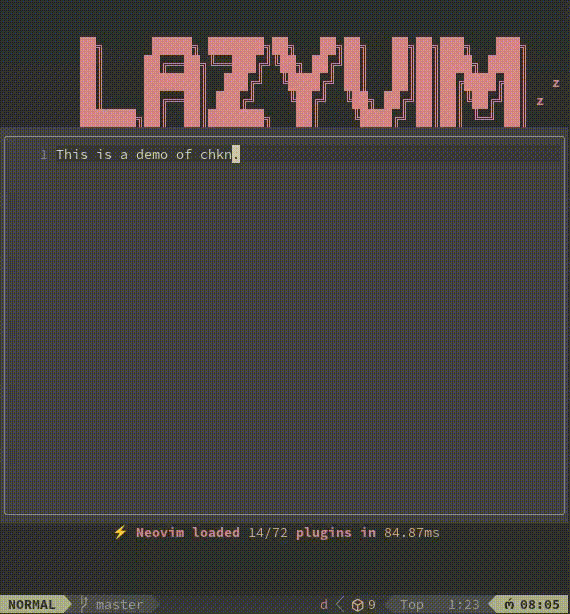

# chkn.nvim

🐔 **Scratch smarter, not harder!**

**chkn.nvim** is a Neovim plugin that gives you a cozy little scratchpad to jot down your fleeting thoughts, ideas, and code snippets — right in the middle of your editor. Like a chicken scratching in the dirt, it’s simple, persistent, and always ready to dig up something useful.



## Features

- 🖋️ **Centered Floating Window**: A clean, distraction-free space to scratch out ideas.
- 💾 **Persistent Memory**: Save your scratches automatically—no more lost nuggets of genius!
- ⚡ **LazyVim-Ready**: Easy to install and configure with your LazyVim setup.
- 🐓 **Quick Access**: Open it with a keybind, scratch away, and get back to work.

## Installation

Using [lazy.nvim](https://github.com/folke/lazy.nvim):
Add the following to `plugins/chkn.lua`, then run `:Lazy sync` and restart Neovim.
With defualt configuration:

```lua
return {
  "ericrswanny/chkn.nvim",
  config = function()
    require("chkn").setup() -- Use the default configuration
  end,
  lazy = false,
  keys = {
    {
      "<leader>sp",
      function()
        vim.cmd("silent! ChknToggle")
      end,
      desc = "Toggle Scratchpad",
    },
  },
}
```

With custom configuration:

```lua
return {
  "ericrswanny/chkn.nvim",
  config = function()
    require("chkn").setup({
      width = 80,
      height = 20,
      border = "rounded",
      persistent = true,
    })
  end,
  lazy = false,
  keys = {
    {
      "<leader>sp",
      function()
        vim.cmd("silent! ChknToggle")
      end,
      desc = "Toggle Scratchpad",
    },
    { -- optional custom filetype
      "<leader>sm",
      function()
        vim.cmd("silent! ChknToggle md")
      end,
      desc = "Toggle Markdown Scratchpad",
    },
  },
}
```

## Development

To get started developing, checkout the project and set the dependency directory to your local dev checkout of the project. And add a plenary dependency to the project.

```lua
return {
  -- Use a local development path instead of the GitHub repository
  dir = "~/dev/chkn.nvim", -- Replace this with the path to your dev dir
  dependencies = { "nvim-lua/plenary.nvim" }, -- plenary for tests
  config = function()
    require("chkn").setup() -- Use the default
  -- Or use this if you would like custom configuration
  -- config = function()
  --   require("chkn").setup({
  --     width = 80,
  --     height = 20,
  --     border = "rounded",
  --     persistent = true,
  --   })
  end,
  lazy = false,
  keys = {
    {
      "<leader>sp",
      function()
        vim.cmd("silent! ChknToggle")
      end,
      desc = "Toggle Scratchpad",
    },
  },
}
```

Run tests with `./run_tests.sh`

GitHub actions can be run locally using `act`.
- https://github.com/nektos/act

- `act`
- `act -j test`

ericrswanny
